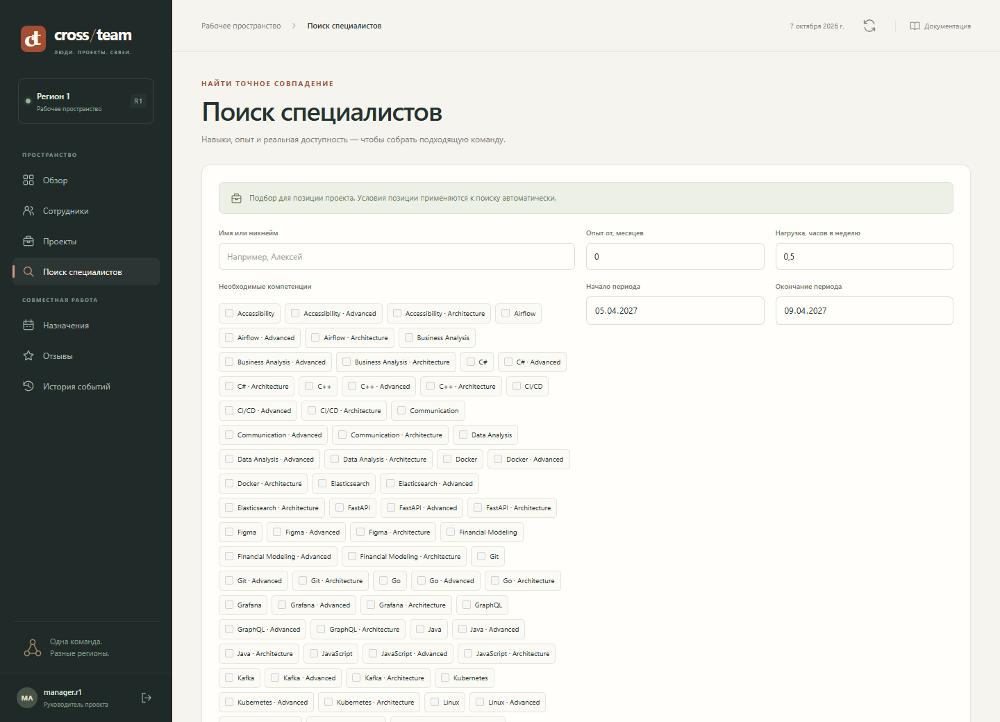
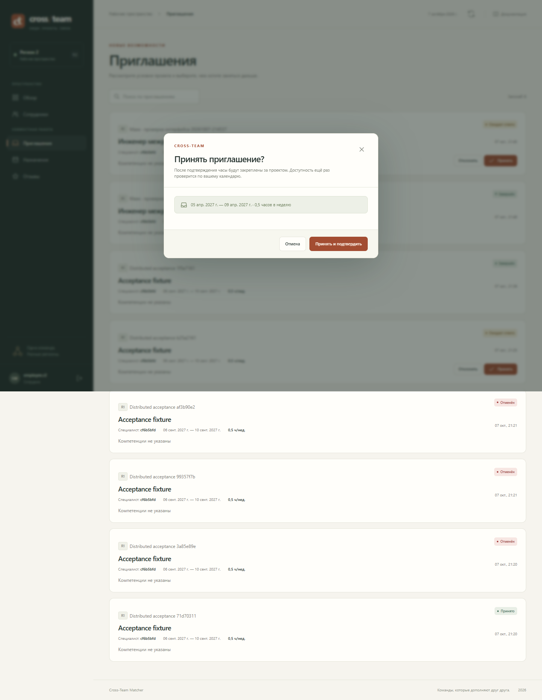
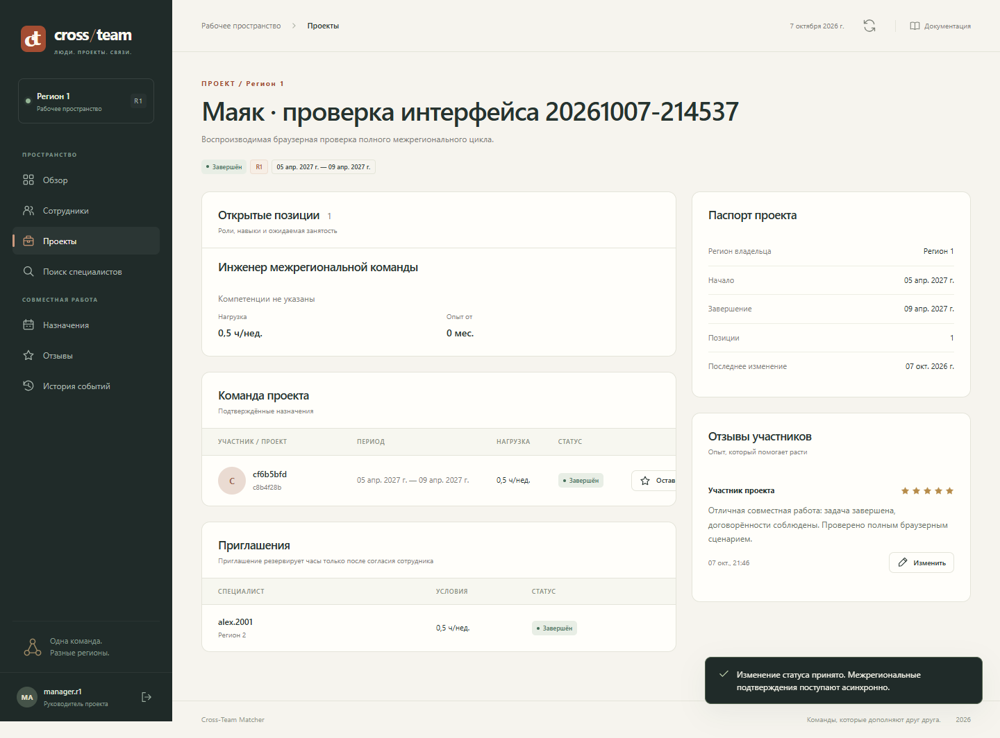
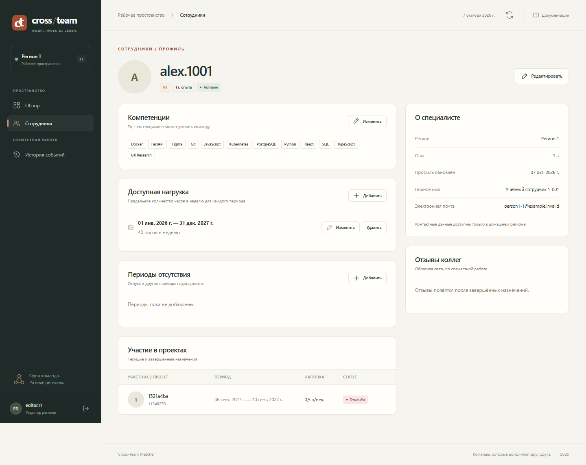
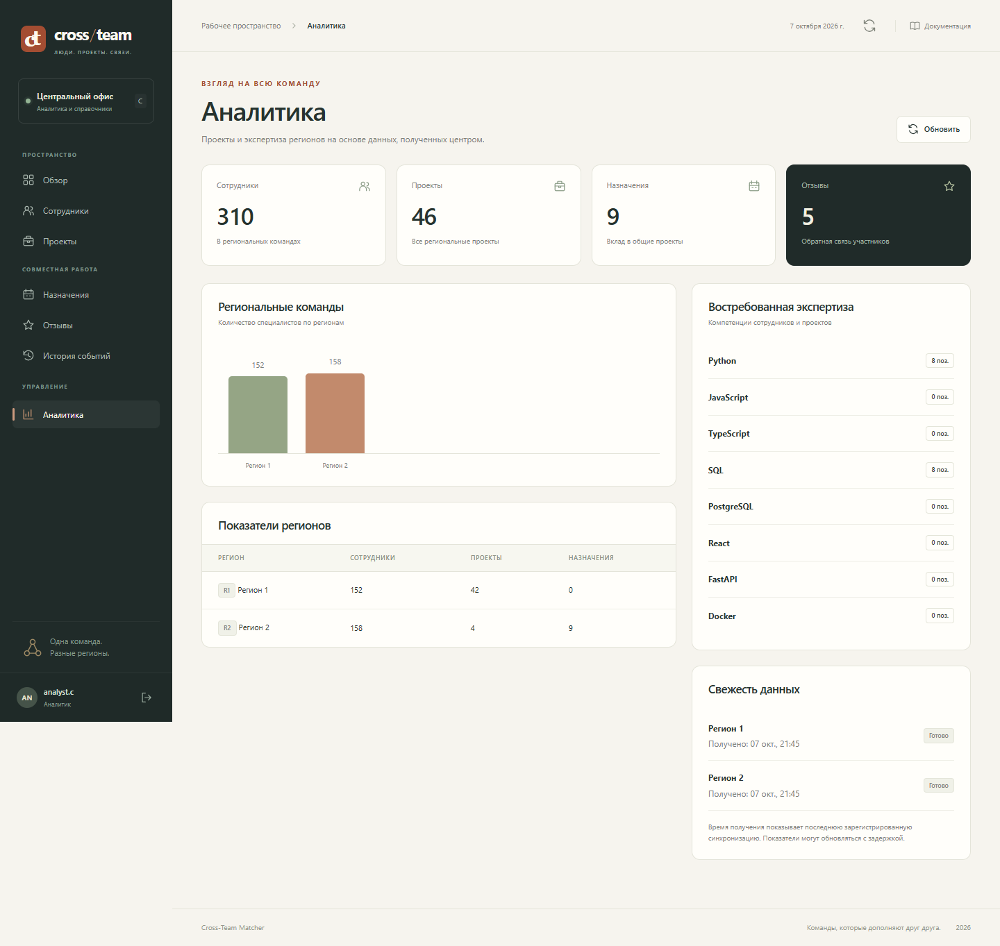
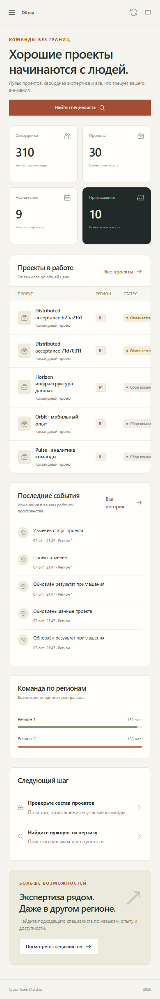

Демонстрация работающего приложения
================================================================================

Ниже показан завершённый межрегиональный сценарий на реальном стенде:
менеджер R1 набрал сотрудника R2, сотрудник подтвердил участие, менеджер
завершил назначение, оставил отзыв и закрыл проект. Скриншоты сделаны
Playwright во время прогона **7 октября 2026, 21:43–21:46, Москва**.
Это сохранённая демонстрация приложения; на GitHub Pages опубликована документация.

Условия демонстрации
--------------------------------------------------------------------------------

Работали три экземпляра FastAPI и три PostgreSQL: центр C, регионы R1 и R2.
Менеджер вошёл как ``manager.r1``, сотрудник — как ``employee.r2``.
Для проверки создан проект «Маяк · проверка интерфейса 20261007-214537».
В позиции указан период **5–9 апреля 2027**, нагрузка **0,5 ч/нед.**;
обязательные компетенции для этого сценария не заданы. Будущий период
позволил провести пример независимо от текущих назначений тестового сотрудника.

1. Менеджер открыл рабочее пространство R1
--------------------------------------------------------------------------------

На главном экране показаны проекты, открытые позиции, приглашения и состояние
узла. Меню зависит от роли: менеджеру доступны подбор, назначения и отзывы.
Приложение читает данные из своей PostgreSQL через один локальный DSN.

.. figure:: evidence/demo/manager-overview-desktop.png
   :alt: Реальный главный экран менеджера на узле R1

   Рабочее пространство менеджера. Снимок общего экрана снят до создания нового проекта.

2. Созданы проект и позиция; выполнен поиск
--------------------------------------------------------------------------------

Менеджер создал проект и позицию, задал период и часы, затем открыл подбор.
Поиск учитывает все обязательные навыки и свободное время на каждый рабочий
день. Данные своего региона читаются из основных таблиц, другого — из локальной
копии. Найденный человек ещё не становится участником проекта.

Дополнительно проверено сохранение режима позиции: после изменения с ``ALL``
на ``OWN_FIRST`` и повторного открытия выбранный режим сохранился.
В UI ему соответствует приоритет своего региона.

   Реальная выдача кандидатов для позиции проекта «Маяк».

3. Приглашение доставлено сотруднику R2
--------------------------------------------------------------------------------

Менеджер выбрал ``alex.2001`` из R2 и отправил предложение. R1 сохранил условия
и исходящую команду в одной транзакции. Фоновый доставщик передал ``OFFER``
владельцу через внешнюю секцию PostgreSQL. Предложение появилось у сотрудника.
До личного согласия назначение и резерв часов не создаются.

4. Сотрудник проверил условия и согласился
--------------------------------------------------------------------------------

Сотрудник вошёл на R2, открыл приглашение и диалог ответа. В диалоге видны
проект, даты и нагрузка. После подтверждения база R2 повторно проверила
календарь и создала назначение. Ответ ``RESULT`` вернул результат менеджеру R1.
Повторная проверка нужна, поскольку поисковая копия могла отстать.

   Открытый диалог ответа на приглашение. Согласие даёт сам сотрудник.

5. Назначение завершено, отзыв сохранён, проект закрыт
--------------------------------------------------------------------------------

Менеджер перевёл проект в ``ACTIVE``, отправил завершение назначения,
дождался подтверждения от R2 и оставил отзыв с оценкой **5 из 5**.
Затем проект перешёл в ``COMPLETED``. Завершение на стороне менеджера
не подменяет подтверждение владельца назначения: право на отзыв появляется
после обработки результата завершения.

   Итог того же сценария: проект завершён, участие завершено, отзыв опубликован.

Что увидели другие роли
--------------------------------------------------------------------------------

В рамках того же браузерного прогона открыты **22 страницы пяти ролей**.
Редактор управляет профилями и календарями своего региона. Сотрудник видит
свои приглашения и участие. Администратор C ведёт каталог компетенций,
аналитик C читает сводные данные регионов.

   Профиль сотрудника: компетенции и данные доступности.

   Аналитика на C. Экран использует локальные копии, а не синхронные запросы к каждому региону.

   Мобильное представление того же приложения.

Зафиксированный результат
--------------------------------------------------------------------------------

.. list-table:: Проверка конечного состояния
   :header-rows: 1
   :widths: 38 62

   * - Поле
     - Фактическое значение
   * - Сценарий
     - ``passed``
   * - Проект
     - ``c8b4f28b-e0b6-475a-8521-268af295d75b``
   * - Приглашение
     - ``c61abcee-e092-4355-b142-478ff5af123f``
   * - Итоговый статус проекта
     - ``COMPLETED``
   * - Число отзывов в проекте
     - ``1``
   * - Сохранение режима поиска
     - ``true``
   * - Ошибки консоли / страницы
     - ``0 / 0``

Последовательность записана в :download:`протоколе браузерного прогона <evidence/ui-smoke.json>`.
Проверки перегрузки календаря, повторов команд и отключений узлов вынесены
в :doc:`protocol`: наличие скриншота само по себе не доказывает эти гарантии.
Техническое объяснение каждого слоя — в :doc:`implementation`, готовое выступление — в :doc:`defense`.
