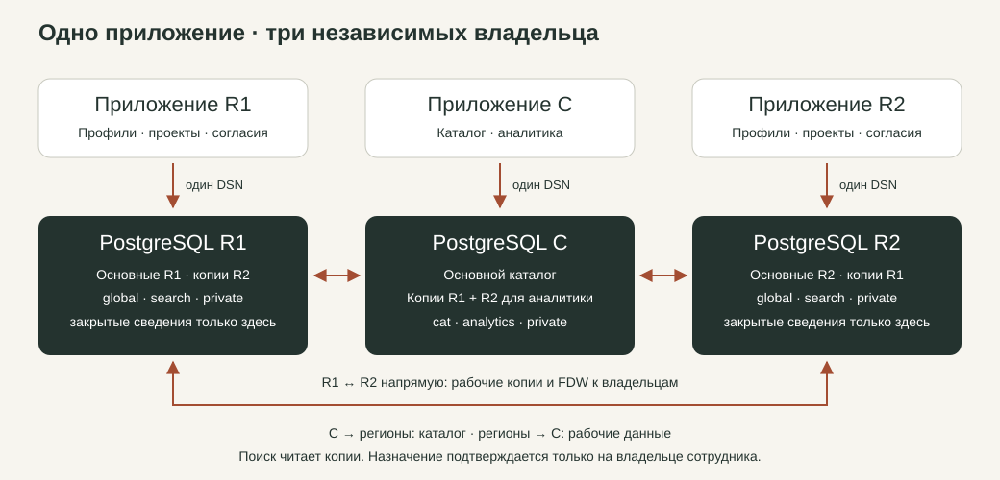

Полное описание реализации и стека
================================================================================

Назначение и результат
--------------------------------------------------------------------------------

Cross-Team Matcher — система подбора сотрудников из разных регионов в
кросс-функциональные проектные команды. Менеджер описывает проект и позиции,
задаёт навыки, стаж, даты и нагрузку, получает подходящих кандидатов и
отправляет предложения. Сотрудник самостоятельно принимает условия на узле
своего региона. Система проверяет календарь, создаёт назначение, доставляет
подтверждение менеджеру, а после завершения позволяет оставить отзыв.

Реализован полный процесс, а не только справочник сотрудников. Состояния,
права, согласие, нагрузка, повтор сообщений, отмена и история изменений
проверяются сервером и SQL. Версия приложения — **4.1.0**; редакция ТЗ — **4.1**.
Документация и скриншоты демонстрации входят в тот же репозиторий.

Технологический стек
--------------------------------------------------------------------------------

.. list-table:: Использованные технологии и их назначение
   :header-rows: 1
   :widths: 24 20 56

   * - Слой
     - Технология
     - Для чего используется
   * - Язык сервера
     - Python 3.11
     - HTTP-обработчики, доступ к БД, доставщик команд, развёртывание и проверки
   * - Веб-сервер
     - FastAPI 0.115.14 / Uvicorn 0.34.3
     - Маршруты страниц и JSON API, валидация параметров, ASGI-запуск
   * - HTML
     - Jinja2 3.1.6
     - Серверные шаблоны входа и рабочего пространства, конфигурация текущей сессии
   * - Интерфейс
     - HTML, CSS, JavaScript
     - Адаптивная сетка, формы, диалоги, таблицы, фильтры и запросы через fetch
   * - Доступ к БД
     - psycopg 3.3.4
     - Параметризованный SQL, транзакции и преобразование строк в словари
   * - Хранение и правила
     - PostgreSQL 17; стенд 17.4
     - Таблицы, ограничения, секции, представления, PL/pgSQL-функции и триггеры
   * - Маршрутизация
     - postgres_fdw
     - Обращение к основной записи другого владельца через внешнюю секцию
   * - Передача копий
     - Логическая репликация PostgreSQL
     - Асинхронные справочники и рабочие данные для поиска и аналитики
   * - Расширения БД
     - pgcrypto, btree_gist
     - Хеши команд и условия ограничений диапазонов календаря
   * - Сессии
     - Starlette SessionMiddleware / itsdangerous 2.2.0
     - Подписанные cookie и раздельные сессии экземпляров
   * - Проверки
     - pytest 9.0.3 / httpx 0.28.1 / Playwright 1.61.0
     - Модульные, SQL, HTTP, распределённые и браузерные сценарии
   * - Документация
     - Sphinx 8.2.3 / Doxygen 1.18.0
     - Сайт проекта, справочник API, схема БД, HTML и RTF лабораторной
   * - Лабораторный пример
     - C++17 / GCC; конфигурация CMake
     - Отдельный пример классов, наследования и автоматического документирования
   * - Доставка проекта
     - Git / GitHub Actions / GitHub Pages
     - История, автоматические проверки и публикация статической документации
   * - Развёртывание
     - Локальные процессы; Docker Compose
     - Проверен Windows-стенд; контейнерная конфигурация подготовлена отдельно

Зависимости закреплены в ``requirements.txt`` и ``requirements-dev.txt``.
В интерфейсе нет React/Vue и отдельной frontend-сборки. SQL выполняется
через psycopg без ORM. Межрегиональный обмен не требует отдельного брокера:
устойчивая очередь находится в PostgreSQL. C++ не участвует в работе
веб-сервиса — это предметный пример для лабораторной № 2.

Топология: три приложения и три базы
--------------------------------------------------------------------------------

   Каждый экземпляр приложения подключается только к своей базе.

* **R1** хранит основные данные своих сотрудников и проектов.
* **R2** хранит основные данные своих сотрудников и проектов.
* **C** хранит общие справочники регионов и компетенций и получает
  рабочие копии регионов для аналитики.

Во всех трёх местах запущен один и тот же код. Окружение задаёт
``NODE_REGION`` и один ``DATABASE_URL``. Код приложения не выбирает
хост по сотруднику и не хранит перечень региональных DSN. Настройки
удалённых серверов, ``SERVER`` и ``USER MAPPING`` создаёт установщик БД.

Веб-приложение и фоновый worker — отдельные процессы. У каждого свой
локальный DSN и ограниченная роль. Worker доставляет команды, а
веб-процесс отвечает на запросы пользователя. Для регионов запускаются
worker-процессы; центральный офис обслуживает каталог и аналитику.

Путь обычного запроса
--------------------------------------------------------------------------------

.. code-block:: text

   Браузер
      → HTTP / JSON
   FastAPI: сессия, роль, CSRF, параметры
      → Repository / ActorDatabase
   psycopg: параметризованный SQL, одна локальная транзакция
      → PostgreSQL своего узла
   search.* / analytics.* для чтения
   global.mutate(action, payload) для бизнес-действия
      → JSON-результат или безопасный код ошибки
   JavaScript обновляет экран

``app/main.py`` принимает запрос и определяет пользователя по сессии.
``app/repository.py`` собирает данные экранов и проверяет роли.
``app/db.py`` открывает транзакцию и устанавливает локальный для неё
``app.actor_id``. SQL повторно проверяет права. При успешном выходе
транзакция фиксируется, при исключении откатывается.

У каждой SQL-команды ограничено время выполнения. Настроены
``connect_timeout=3`` с, ``statement_timeout=8`` с и ``lock_timeout=5`` с.
При конфликте сериализации локальная мутация повторяется до трёх попыток.
Записанный бизнес-отказ фиксируется как результат процесса; HTTP-ошибка
после этого не должна откатывать его квитанцию и событие.

Основные маршруты: ``/api/me``, ``/api/employees``, ``/api/projects``,
``/api/search``, ``/api/invitations``, ``/api/assignments``, ``/api/reviews``,
``/api/catalog``, ``/api/analytics`` и ``/api/events``. Изменения передаются
в ``POST /api/actions/{action}`` с CSRF-токеном. Детали объекта адресуются
парой ``owner_region`` и UUID. Машиночитаемый контракт — ``/openapi.json``.

Модель данных и владение
--------------------------------------------------------------------------------

Система содержит **19 логических отношений**. Физические секции и
реплики не считаются дополнительными предметными сущностями.

.. list-table:: Логические сущности
   :header-rows: 1
   :widths: 36 64

   * - Группа
     - Отношения и назначение
   * - Справочники, 2
     - regions, competencies: регионы и компетенции; основной владелец — C
   * - Сотрудники и календарь, 5
     - employees, employee_competencies, employee_private, capacity_periods, unavailability_periods
   * - Проект и предложение, 4
     - projects, project_positions, position_competencies, invitations; владелец — регион проекта
   * - Согласие и занятость, 2
     - invitation_responses, assignments; владелец — регион сотрудника
   * - История и обратная связь, 2
     - workflow_events, reviews
   * - Доступ и доставка, 4
     - accounts, account_roles, outbox, processed_commands

**global** — логические секционированные отношения. Секция выбирается
по ``owner_region``: для своей записи она локальная, для чужой — внешняя.
Рабочие основные данные регионов физически размещены в ``r1_data`` и
``r2_data``; эти имена не используются в прикладной маршрутизации.

**search** — представления поиска по собственным данным и местным копиям.
**analytics** — сводные представления на C. **cat** — справочники.
**private** — локальные контакты, аккаунты, роли и outbox. Квитанции имеют
оболочку в global для адресной доставки, но не входят в публикации.

У сущности один основной владелец. Изменение владельца не является
обычным редактированием поля. На физических владельцах действуют ключи,
CHECK, внешние ключи и ограничения, которые можно обеспечить локально.
Глобальные UNIQUE/FK поверх внешних секций не заявляются.

Поиск и календарь
--------------------------------------------------------------------------------

Поиск получает период, часы в неделю, минимальный стаж и список навыков.
Сотрудник должен иметь **каждую** обязательную компетенцию. Проверка
нагрузки выполняется на каждый рабочий день, а не по среднему за период.
Отсутствие подтверждённого периода доступности не означает свободное время.
Полные дни отсутствия исключают назначение.

В расчёте используются понедельник–пятница; государственные праздники
отдельно не моделируются. Недельные часы распределяются на пять дней.
Например, бюджет 40 ч/нед. даёт 8 часов в рабочий день; при назначении
24 ч/нед. свободно 3,2 часа в день. Новая нагрузка должна помещаться в
остаток каждого дня. Интервалы дат включают обе границы.

Поддержаны режимы ``OWN_ONLY``, ``ALL`` и ``OWN_FIRST``. В интерфейсе
они отображаются как свой регион, все регионы и свой регион первым;
клиентское обозначение ``LOCAL_FIRST`` преобразуется в ``OWN_FIRST``.
Фильтрация, календарь и приоритет выполняются **до** страницы из 25 записей.
Выбор кандидата ещё не резервирует часы.

За конкурентные изменения отвечает ``employees.schedule_version``.
Мутация календаря сначала обновляет строку сотрудника; конкурирующие
операции сериализуются на владельце. После получения права на изменение
выполняется проверка актуального бюджета. Назначения ``ACTIVE`` и
``CONFLICT`` учитываются в занятости; конфликт не освобождает часы сам.
При замене условий старое назначение исключается из проверки замены,
чтобы не списывать одни часы дважды.

Межрегиональный процесс
--------------------------------------------------------------------------------

.. list-table:: Что происходит с приглашением сотруднику R2 из проекта R1
   :header-rows: 1
   :widths: 8 28 64

   * - Шаг
     - Где
     - Изменение
   * - 1
     - R1, менеджер
     - Создаются приглашение, неизменяемые terms_snapshot / terms_hash и запись OFFER в outbox одной транзакцией
   * - 2
     - R1, worker
     - Сообщение арендуется; INSERT в global.processed_commands через FDW направляется в R2
   * - 3
     - R2, владелец
     - Обработчик проверяет сообщение, создаёт входящее предложение и квитанцию атомарно
   * - 4
     - R2, сотрудник
     - Личное согласие проверяет условия, навыки и календарь; создаются назначение, событие и ответная команда
   * - 5
     - R2 → R1
     - RESULT обновляет состояние приглашения и готовность проекта на владельце проекта
   * - 6
     - R1 → R2 → R1
     - COMPLETE завершает участие у владельца сотрудника; квитанция открывает возможность отзыва

В транспорте используются ``OFFER``, ``CANCEL``, ``COMPLETE`` и ``RESULT``.
Локальные пользовательские действия и семь бизнес-возможностей контракта
не нужно путать с четырьмя типами межрегиональных сообщений.

``app/worker.py`` использует три отдельные транзакции: взять местное
сообщение, доставить владельцу, отметить доставку на исходном узле.
Аренда сообщения длится 30 секунд; после падения worker она истекает.
Повторная попытка откладывается с увеличением интервала, максимум до 60 секунд.

Доставка выполняется **как минимум один раз**. Однократность бизнес-эффекта
обеспечивается квитанцией: повтор с тем же ID, источником, типом и хешем
получает сохранённый результат. Другой хеш с тем же ID — конфликт команды.
Если удалённый COMMIT произошёл, а ответ потерялся, повтор не создаёт
второе назначение. Недоступный владелец оставляет действие ожидающим.

Состояния и история
--------------------------------------------------------------------------------

Проект проходит состояния ``FORMING``, ``READY``, ``ACTIVE`` и
``COMPLETED``; для отмены есть ``CANCELLING`` и ``CANCELLED``.
У назначения — ``ACTIVE``, ``CONFLICT``, ``CANCELLED`` и ``COMPLETED``.
Приглашение и ответ имеют собственные состояния ожидания, принятия,
отказа, отклонения, замены, отмены и завершения.

Состояние проекта и состояние одного назначения — разные вещи. Нельзя
считать доставку оферты согласием сотрудника. Нельзя считать отправку
команды завершения подтверждённым завершением. Поздние сообщения
проверяются по версии и терминальному состоянию и не должны возвращать
отменённое участие в активное.

Изменение условий создаёт новую версию и требует нового согласия.
Отзыв разрешён только после подтверждённого завершения: оценка 1–5,
комментарий 1–2000 символов. Правка отзыва увеличивает версию и
записывается в ``workflow_events``. Отмена сохраняет историю.

Репликация, свежесть и отказы
--------------------------------------------------------------------------------

Имеются три направления логической репликации:

* C → R1 и C → R2: ``regions`` и ``competencies``.
* R1 ↔ R2: рабочие копии для межрегионального поиска.
* R1 и R2 → C: рабочие копии для центральной аналитики.

В публикации включены только основные разрешённые таблицы владельца.
Копии повторно не публикуются. Контакты, аккаунты, outbox и квитанции
не передаются логической репликацией. Приложение не записывает в копию
вместо недоступного основного владельца.

Свежесть оценивается по состоянию подписки и времени последнего
полученного сообщения. Отключённая/неготовая подписка, отсутствие времени
или сообщений более 60 секунд означают неподтверждённую свежесть.
Этот индикатор описывает наблюдаемое состояние канала, а не точный лаг
каждой бизнес-строки. Аналитика из нескольких копий не является единым
глобальным снимком на один момент времени.

При отказе C регионы сохраняют локальную работу и прямой обмен между
собой. При отказе R2 поиск на R1 может показать его сохранённые копии,
но новое действие владельца R2 не подтверждается. После восстановления
связи исходящая очередь продолжает доставку.

Пользователи и безопасность
--------------------------------------------------------------------------------

.. list-table:: Разделение прав
   :header-rows: 1
   :widths: 25 75

   * - Роль
     - Основные разрешённые действия
   * - Сотрудник
     - Просмотр своих приглашений и назначений, личное принятие или отклонение
   * - Редактор региона
     - Профили, подтверждённые навыки, доступность и отсутствия своего региона
   * - Менеджер
     - Проекты, позиции, подбор, приглашения, завершение и отзывы в своей области прав
   * - Администратор каталога
     - Изменение компетенций на центральном узле
   * - Аналитик
     - Просмотр центральных сводок и состояния источников

Пароли хранятся как PBKDF2-HMAC-SHA256 с отдельной случайной солью и
600 000 итераций. Сессия подписана, ограничена восемью часами; имена
cookie различаются по узлам. Подпись защищает целостность cookie,
но не означает шифрование его содержимого.

Мутации требуют CSRF-токен. ``actor_id``, ``manager_id`` и ``author_id``
из JSON браузера отвергаются: личность берётся из сессии. Права проверяются
и в серверном слое, и на владельце в SQL. SQL-запросы параметризованы.
Прямое изменение физических таблиц ограничено правами БД.

В приложении заданы CSP, запрет встраивания в чужие страницы и
ограничение частоты неверного входа. Локальные пароли и ключи находятся
в ``.local`` и не публикуются. Для сетевого развёртывания нужны HTTPS,
TLS PostgreSQL и Secure-cookie; проверенный стенд использует loopback.

Организация исходников
--------------------------------------------------------------------------------

.. list-table:: Где находится реализация
   :header-rows: 1
   :widths: 35 65

   * - Путь
     - Содержимое
   * - app/main.py, config.py, auth.py
     - HTTP, конфигурация узла, вход, сессии и CSRF
   * - app/repository.py, db.py
     - Запросы экранов, доступ к одному DSN, контекст пользователя и транзакции
   * - app/worker.py
     - Аренда, доставка, повтор команд и отметка outbox
   * - app/templates/, app/static/
     - HTML-шаблоны, CSS и клиентский контроллер
   * - sql/00_schema.sql
     - Схемы, 19 отношений, физические владельцы, ключи и базовые функции
   * - sql/01_workflow.sql, 02_views.sql
     - Действия, состояния, календарь, поиск и аналитика
   * - sql/03_*.sql, 04_*.sql
     - Защита условий, приватности квитанций и терминальных состояний
   * - replication/bootstrap.py
     - FDW, права, публикации и подписки
   * - scripts/local.py, seed.py, backup.py
     - Управление стендом, синтетические данные, резервирование и восстановление
   * - contracts/, tests/
     - Контракты и проверки разных уровней
   * - docs/, report/, labs/lab2/
     - Документация, публичный отчёт и выполненная лабораторная

Что проверено и что ограничено
--------------------------------------------------------------------------------

В протоколе 7 октября: 9 модульных проверок, 11 SQL-сценариев,
4 HTTP-теста, 22 проверки страниц пяти ролей и полный браузерный процесс.
Распределённые T09–T16 завершились успешно с целевыми повторными прогонами.
Восстановление подтверждено совпадением контрольных состояний 98 физических
таблиц. p95 поиска — **2,542 с** при 100 измерениях и пяти параллельных
пользователях в одном зафиксированном локальном сценарии.

Подробная :doc:`demonstration` содержит реальные экраны и результат
бизнес-процесса. :doc:`lab2` содержит выполненную работу, журналы и
скриншоты Git, C++ и Doxygen. :doc:`protocol` фиксирует среду и измерения.

Ограничения: асинхронные копии, отсутствие глобальной 2PC и автоматического
failover, отсутствие глобальных FK/UNIQUE через FDW. Compose подготовлен,
но Docker-прогон не выполнялся. GitHub Pages размещает отчёт и документацию;
FastAPI, worker и PostgreSQL запускаются отдельно.
