Лабораторная работа № 2 — выполненный отчёт
================================================================================

**Тема:** инструментальные средства управления версиями и составления
проектной документации. **Дата выполнения:** 8 октября 2026 года.
**Команда:** Карпов Арсений Кириллович, Лебедев Матвей Олегович,
Кречун Артём Васильевич.

Выполнены Git-часть из 19 шагов и документирование C++-проекта средствами
Doxygen. Здесь приведены полученные результаты, скриншоты и созданные файлы.
Команды выполнялись на Windows 10; использованы Git 2.42.0.windows.2,
Python 3.11.2, GCC 13.2.0 и Doxygen 1.18.0.

Для C++ использован допустимый по методическим указаниям аналог среды —
GCC с разделением исходников на ``.h`` и ``.cpp``. Проверена именно эта
сборка; выполнение в Visual Studio не заявляется.

Часть 1. Работа с Git
--------------------------------------------------------------------------------

Подготовка и исходное состояние
~~~~~~~~~~~~~~~~~~~~~~~~~~~~~~~~~~~~~~~~~~~~~~~~~~~~~~~~~~~~~~~~~~~~~~~~~~~~~~~~

Созданы отдельный bare-репозиторий ``origin.git`` и два рабочих клона,
``author`` и ``reviewer``. Они находятся в отдельном каталоге лабораторной.
Для учебных коммитов использована явно условная личность ``Lab Participant``.
Основной репозиторий Cross-Team Matcher в эксперименте не сбрасывался.

Пример вычисляет свободный бюджет сотрудника. При бюджете 40 и занятой
нагрузке 24 ожидается 16 часов. В ветке ``bad-feature`` намеренно внесено
сложение вместо вычитания. В ``main`` та же строка изменена на
``max(0, capacity - assigned)``. Таким образом получены реальные
конкурирующие изменения одной строки и настоящий конфликт слияния.

Все 19 шагов и фактический результат
~~~~~~~~~~~~~~~~~~~~~~~~~~~~~~~~~~~~~~~~~~~~~~~~~~~~~~~~~~~~~~~~~~~~~~~~~~~~~~~~

.. list-table:: Выполнение Git-части
   :header-rows: 1
   :widths: 6 46 48

   * - №
     - Выполненное действие
     - Полученный результат
   * - 1
     - ``git clone``; подготовлены два клона
     - ``author`` и ``reviewer`` подключены к одному локальному remote
   * - 2
     - ``git pull --ff-only``
     - ``Already up to date``
   * - 3
     - ``git diff HEAD^``
     - Показано отличие от предыдущего коммита: добавленный README
   * - 4
     - ``git checkout -b bad-feature``
     - Создана отдельная ветка ошибки
   * - 5
     - Ошибочная формула, commit и push ветки
     - Коммит ``e81d25d``; ветка появилась в remote
   * - 6
     - ``git checkout main``
     - Возврат в основную ветку
   * - 7
     - Pull и независимое изменение той же строки
     - Зафиксирован исходный HEAD ``72d53b8``
   * - 8
     - ``git merge --no-ff bad-feature``
     - Реальный ``CONFLICT (content)``; код возврата 1; ``UU budget.py``
   * - 9
     - Конфликт намеренно разрешён ошибочно, результат закоммичен
     - Создан merge-коммит ``d7b5f84`` с неверной формулой
   * - 10
     - Запущен тест ``test_budget.py``
     - ``AssertionError``, код возврата 1: ошибка обнаружена
   * - 11
     - ``git reset --hard ORIG_HEAD``
     - HEAD снова ``72d53b8``; тест исходной версии прошёл
   * - 12
     - ``git checkout bad-feature``
     - Открыта ветка для исправления
   * - 13
     - ``git branch -m bad-feature good-feature``
     - Ветка переименована в ``good-feature``
   * - 14
     - Формула исправлена, добавлена проверка перегрузки, выполнен commit
     - ``c214af1``; оба условия теста проходят
   * - 15
     - ``git checkout main``
     - Возврат в ``main``
   * - 16
     - ``git pull --ff-only``
     - Актуальность основной ветки проверена
   * - 17
     - ``git merge --no-ff good-feature`` и повторный тест
     - Успешное слияние ``233ed60`` без конфликта; тест прошёл
   * - 18
     - ``git push origin main``
     - Исправленный результат отправлен в локальный remote
   * - 19
     - Удалены локальная ``good-feature`` и удалённая ``bad-feature``
     - В списке веток остались ``main`` и ``origin/main``

Конфликт, ошибка и отмена слияния
~~~~~~~~~~~~~~~~~~~~~~~~~~~~~~~~~~~~~~~~~~~~~~~~~~~~~~~~~~~~~~~~~~~~~~~~~~~~~~~~

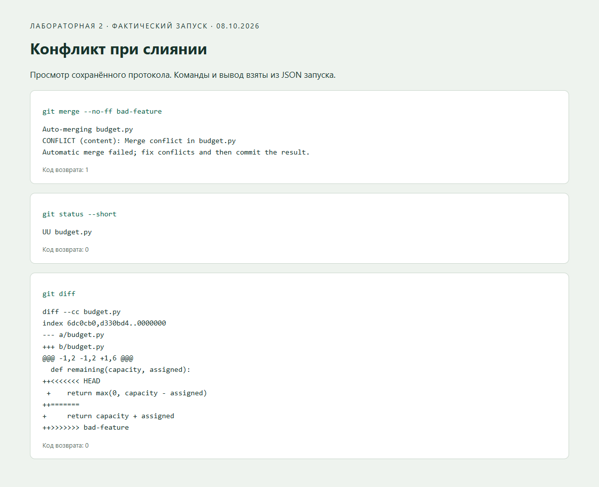

   Снимок просмотра сохранённого журнала команд шага 8.

В конфликтном файле зафиксировано:

.. literalinclude:: evidence/lab2/conflict.txt
   :language: text

После неправильного разрешения конфликта тест обнаружил, что результат
равен 64 вместо 16. Перед сбросом проверено, что ``ORIG_HEAD`` совпадает
с сохранённым HEAD до слияния. Сброс выполнен только в новом учебном клоне.

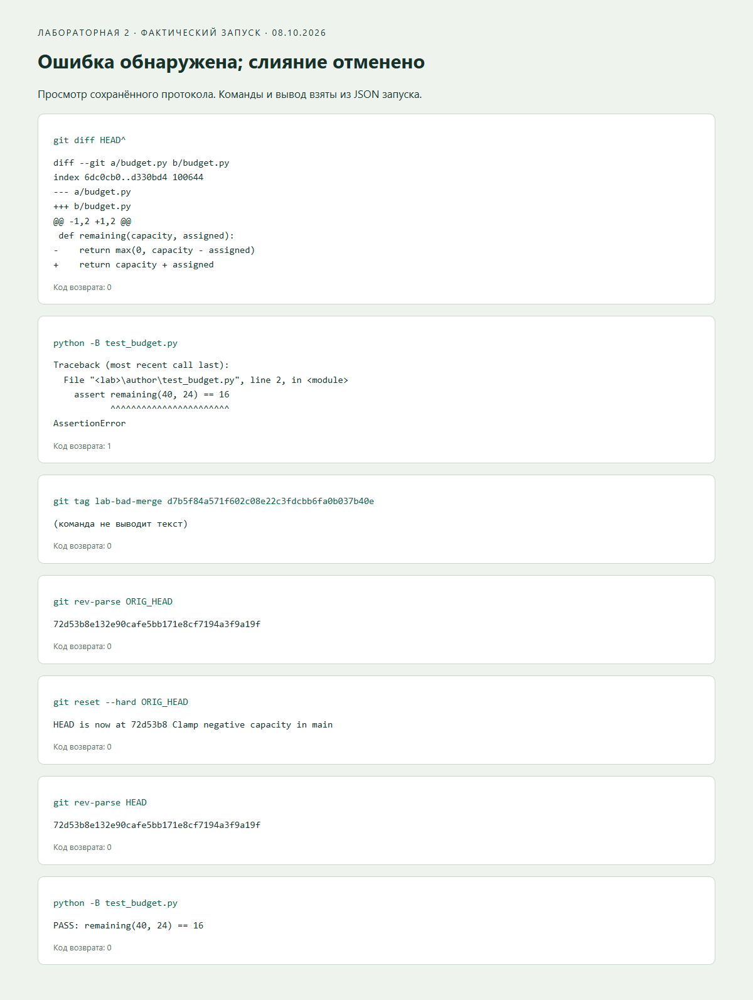

   Фактические команды и коды возврата шагов 10–11.

Полный SHA до merge и после reset одинаков:

.. code-block:: text

   before_merge = 72d53b8e132e90cafe5bb171e8cf7194a3f9a19f
   after_reset  = 72d53b8e132e90cafe5bb171e8cf7194a3f9a19f

Исправление и проверка во втором клоне
~~~~~~~~~~~~~~~~~~~~~~~~~~~~~~~~~~~~~~~~~~~~~~~~~~~~~~~~~~~~~~~~~~~~~~~~~~~~~~~~

В исправленной ветке восстановлено вычитание с ограничением снизу нулём.
Тест проверил обычную нагрузку и перегрузку. После push второй клон получил
изменения через ``git pull --ff-only`` и независимо запустил тот же тест.
HEAD второго клона совпал с итоговым коммитом первого:
``233ed6083405f47132d186500c32858bf4522082``.

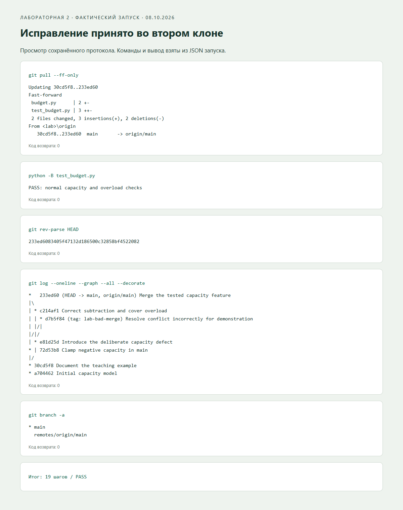

   Граф сохраняет ошибочное слияние учебным тегом ``lab-bad-merge``;
   основная ветка указывает на проверенный результат.

Git-часть завершилась со статусом **PASS: 19 шагов**.
Скриншоты Git показывают браузерный просмотр реального журнала, а не окно
терминала. Текст команд, stdout, stderr и коды возврата доступны полностью:
:download:`журнал TXT <generated/git-transcript.txt>` и
:download:`результаты JSON <evidence/lab2/git-run.json>`.
``origin`` в этом эксперименте — локальный bare-репозиторий; сетевой GitHub
push не является частью учебного сценария.

Часть 2. C++ и Doxygen
--------------------------------------------------------------------------------

Реализованный учебный проект
~~~~~~~~~~~~~~~~~~~~~~~~~~~~~~~~~~~~~~~~~~~~~~~~~~~~~~~~~~~~~~~~~~~~~~~~~~~~~~~~

В ``labs/lab2`` находятся базовый класс ``Employee`` и производный
``RegionalEmployee``. Объявления отделены от реализации.

.. list-table:: Состав проекта
   :header-rows: 1
   :widths: 28 72

   * - Файл
     - Назначение
   * - ``Employee.h``
     - Объявления классов, методов и полей с документирующими комментариями
   * - ``Employee.cpp``
     - Конструкторы, проверки аргументов, вычисление остатка и методы доступа
   * - ``main.cpp``
     - Исполняемый пример с тремя assert-проверками
   * - ``mainpage.dox``
     - Главная страница документации с назначением модели и примером
   * - ``Doxyfile``
     - Русский язык, UTF-8, HTML и RTF, просмотр исходников
   * - ``CMakeLists.txt``
     - Конфигурация переносимой C++17-сборки

``Employee`` хранит имя и недельный бюджет; метод ``available`` возвращает
разность бюджета и назначенных часов. Отрицательное значение в этой C++-модели
сохраняется как признак перегрузки. ``RegionalEmployee`` наследует имя
и бюджет и добавляет неизменяемый номер региона.

Учебный Git-пример и C++-пример различаются: Git-пример ограничивает остаток
нулём для проверки слияния, C++-пример сохраняет отрицательное значение
для демонстрации документированного контракта. В основном приложении
доступность рассчитывается по дням в SQL.

Сборка и запуск
~~~~~~~~~~~~~~~~~~~~~~~~~~~~~~~~~~~~~~~~~~~~~~~~~~~~~~~~~~~~~~~~~~~~~~~~~~~~~~~~

Выполнена компиляция с ``-std=c++17 -Wall -Wextra -pedantic``.
Процесс компилятора завершился с кодом 0, предупреждений не выдал.
Созданный ``CrossTeamLab2.exe`` запущен; проверены три условия:

.. literalinclude:: ../labs/lab2/main.cpp
   :language: cpp
   :start-at: int main()

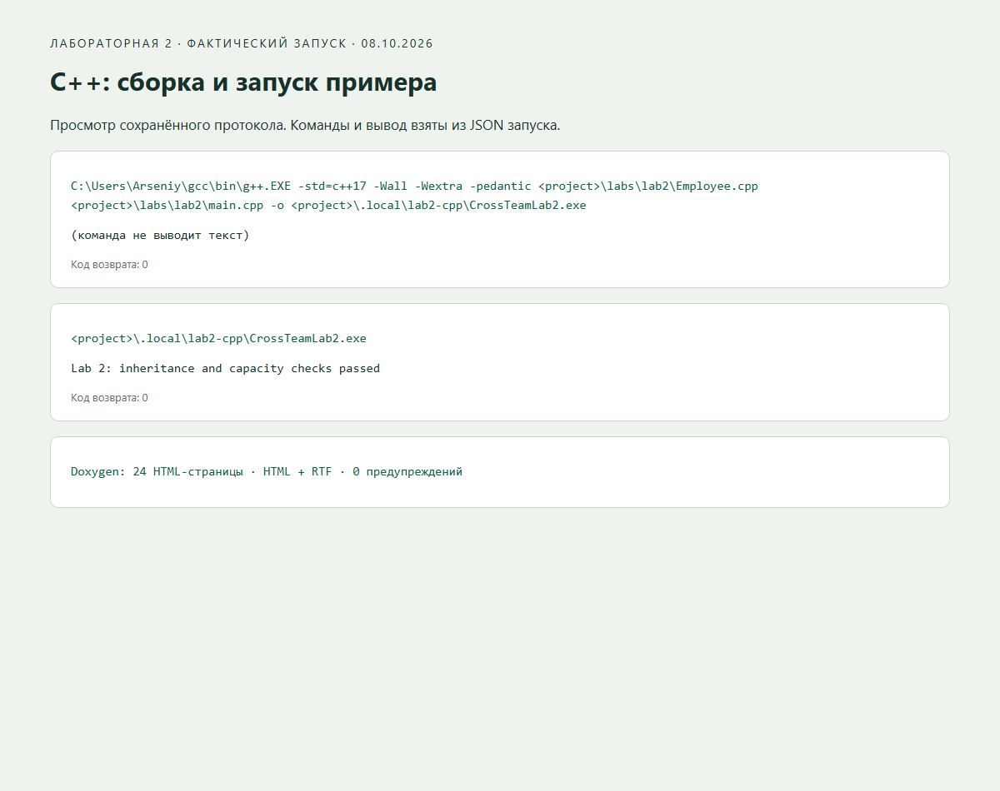

   Вывод программы: ``Lab 2: inheritance and capacity checks passed``, код 0.

Сгенерированная справка
~~~~~~~~~~~~~~~~~~~~~~~~~~~~~~~~~~~~~~~~~~~~~~~~~~~~~~~~~~~~~~~~~~~~~~~~~~~~~~~~

Doxygen обработал исходники и создал **24 HTML-страницы** и файл
``refman.rtf`` размером **90 043 байта**. Журнал предупреждений пуст.
Параметр ``EXTRACT_PRIVATE = YES`` включает также документированное
поле ``region_`` производного класса.

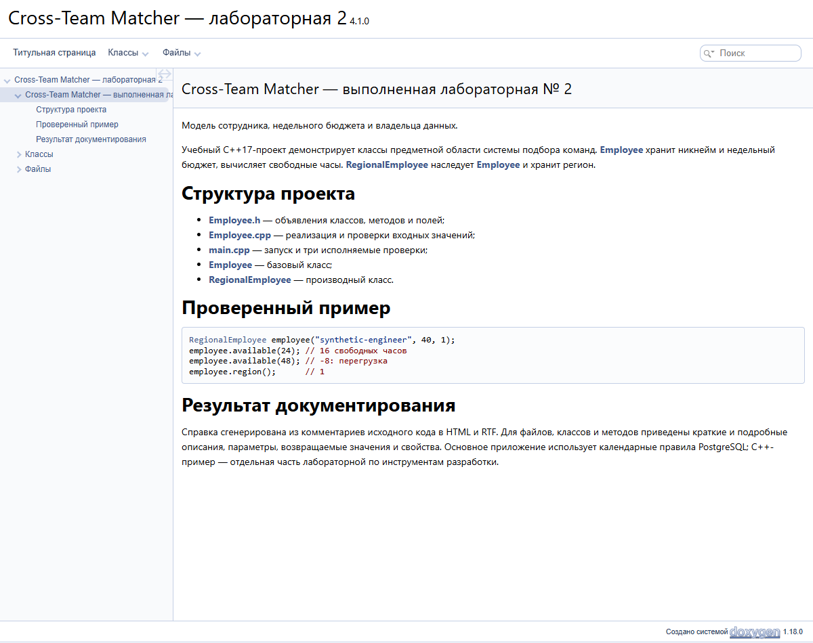

   Главная страница: назначение модели, файлы проекта и пример использования.

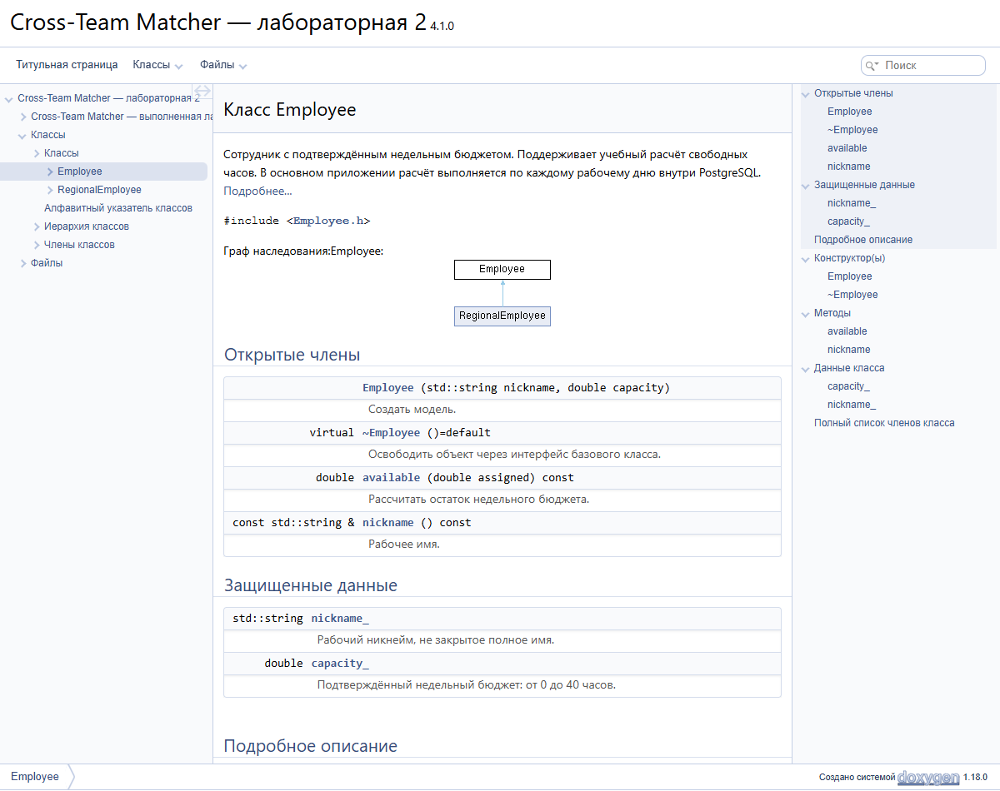

   Базовый класс Employee: описание, открытые методы и защищённые поля.

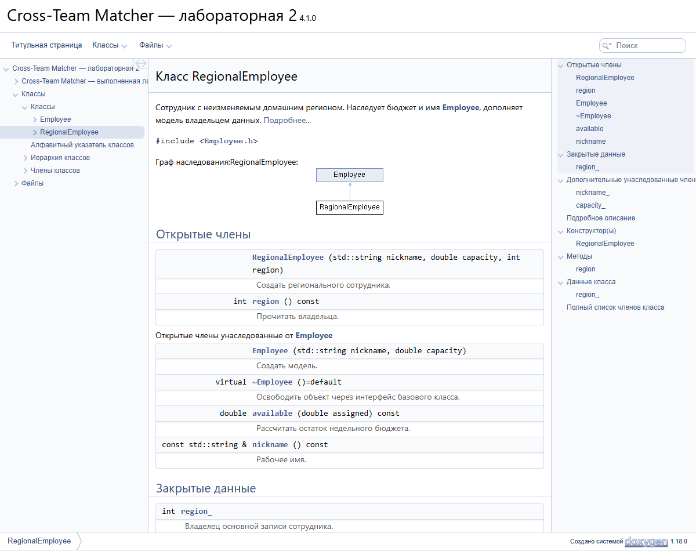

   Производный класс RegionalEmployee и отношение наследования.

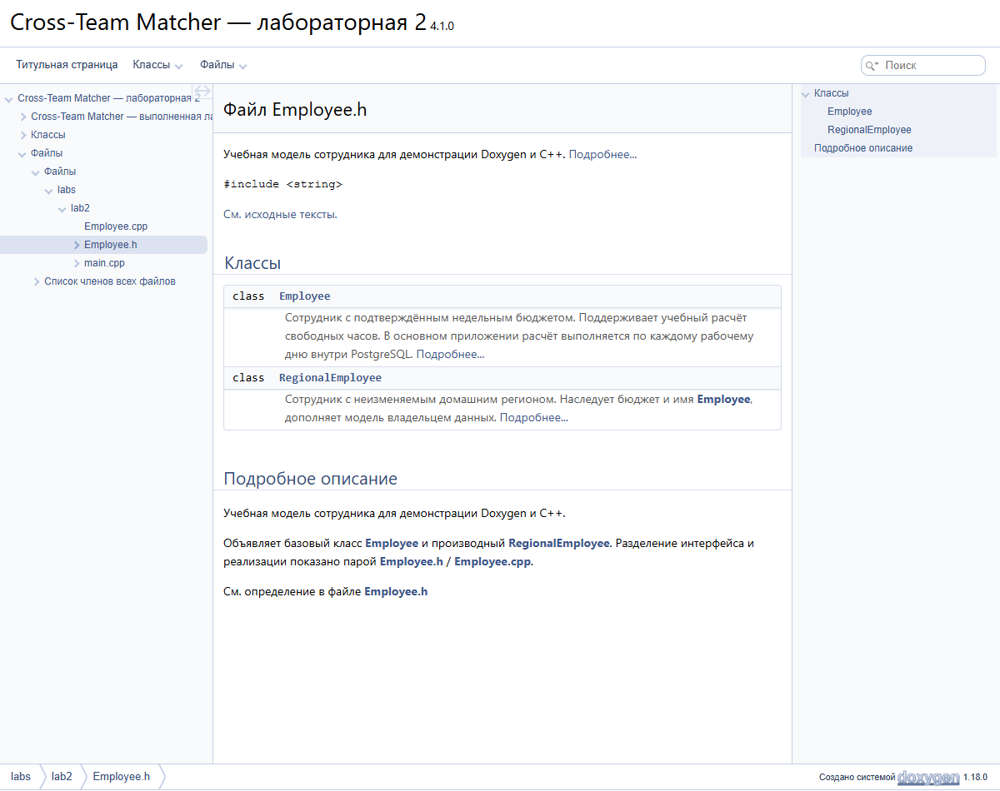

   Справка по ``Employee.h`` и переход к исходному тексту.

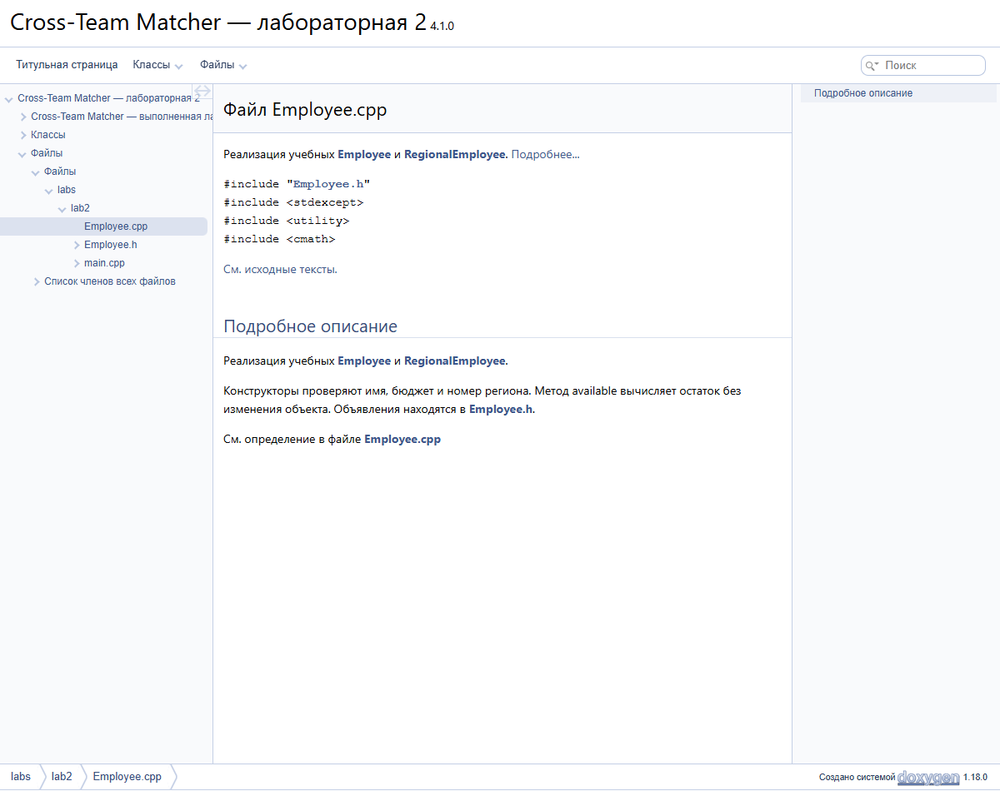

   Справка по ``Employee.cpp``. Объявление и реализация представлены раздельно.

Изменение комментария и повторная генерация
~~~~~~~~~~~~~~~~~~~~~~~~~~~~~~~~~~~~~~~~~~~~~~~~~~~~~~~~~~~~~~~~~~~~~~~~~~~~~~~~

Исходный заголовок сохранён до изменения. Doxygen запущен для обеих версий.
У ``Employee::available`` краткое описание заменено с «Получить свободные
часы» на «Рассчитать остаток недельного бюджета». Добавлены примеры
``available(24) = 16`` и ``available(48) = -8`` при бюджете 40,
описание неизменности объекта и требования к параметру ``assigned``.

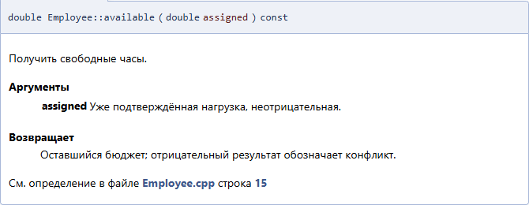

   До изменения: краткое описание, параметр и результат.

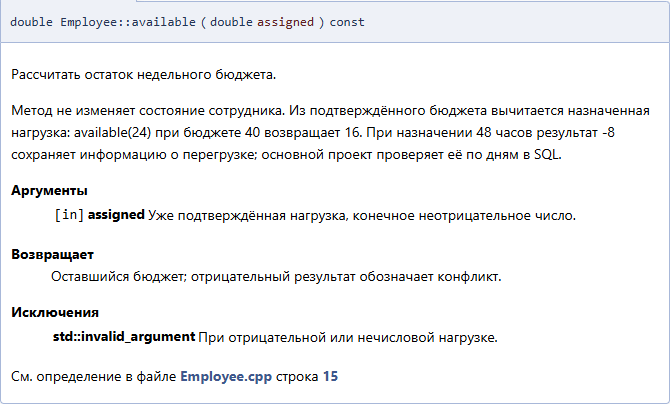

   После повторной сборки: обновлённый текст, примеры, параметр, результат и исключение.

Скрипт проверил наличие старого текста в первой сборке и нового — во второй.
Результат ``comment_update_verified: true`` сохранён вместе с SHA-256 обоих
заголовков в :download:`протоколе сборки <evidence/lab2/documentation-run.json>`.

RTF открыт в текстовом редакторе
~~~~~~~~~~~~~~~~~~~~~~~~~~~~~~~~~~~~~~~~~~~~~~~~~~~~~~~~~~~~~~~~~~~~~~~~~~~~~~~~

Созданный ``refman.rtf`` открыт в Microsoft Word. Проверено наличие классов
и обновлённого описания метода; документ экспортирован в PDF и HTML.
Снимок ниже показывает HTML-экспорт открытого в Word документа.

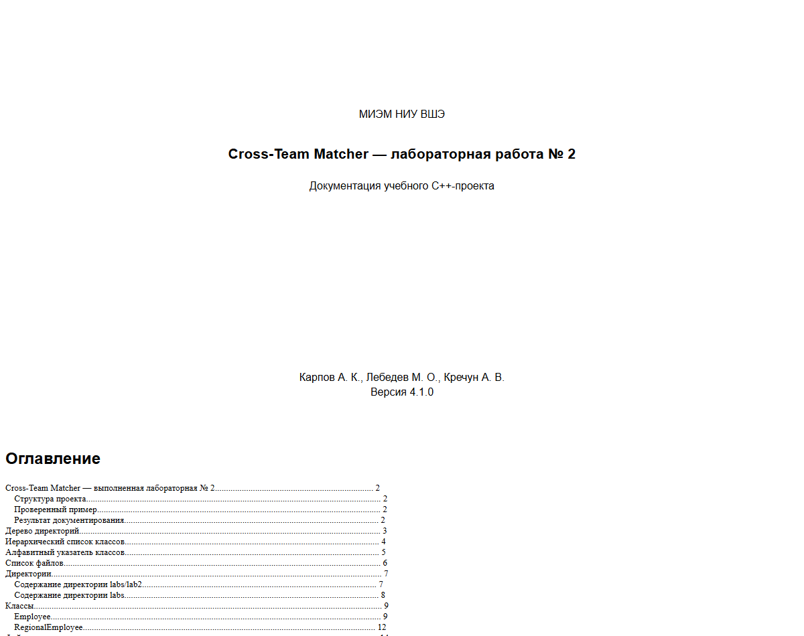

   Титульная страница RTF-документа после открытия и экспорта средствами Word.

Готовые результаты:
`HTML-справка Doxygen <lab2-reference/index.html>`_,
:download:`документ RTF <evidence/lab2/refman.rtf>`,
:download:`документ PDF <evidence/lab2/refman.pdf>` и
:download:`протокол открытия в Word <evidence/lab2/word-run.json>`.
Для автономного просмотра также сохранён :download:`архив HTML <evidence/lab2/doxygen-html.zip>`.

Итог лабораторной
--------------------------------------------------------------------------------

Получен завершённый цикл работы с ветками: клонирование, конфликт,
ошибочное слияние, обнаружение ошибки тестом, отмена через ``ORIG_HEAD``,
исправление, повторное слияние и проверка во втором клоне. C++-проект
скомпилирован и выполнен; документированы классы, наследование, методы,
аргументы, результаты, исключения и поля. Созданы HTML и RTF;
повторная генерация отразила изменение комментария. RTF открыт редактором.

Для повторения сохранены ``scripts/lab2_git_demo.py``,
``scripts/lab2_documentation.py`` и ``scripts/lab2_capture.py``.
Повторные запуски создают новые результаты; этот отчёт фиксирует
конкретное выполнение 8 октября 2026 года.
